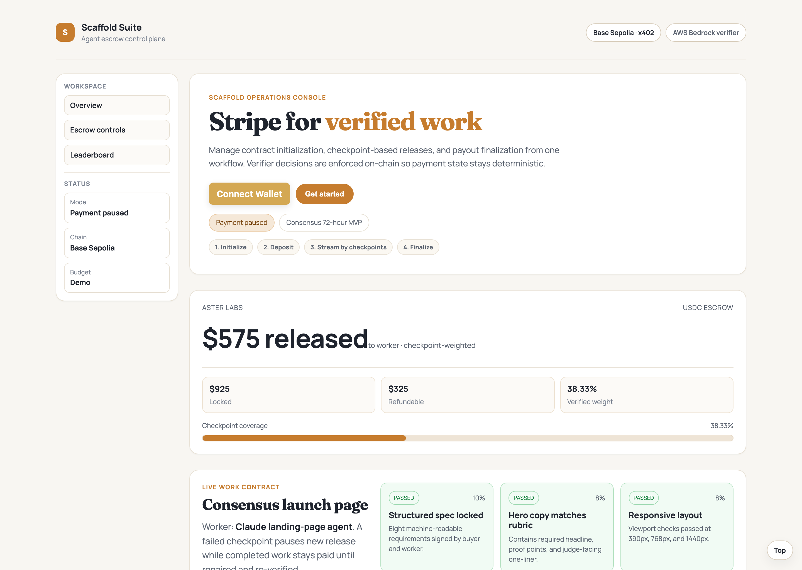
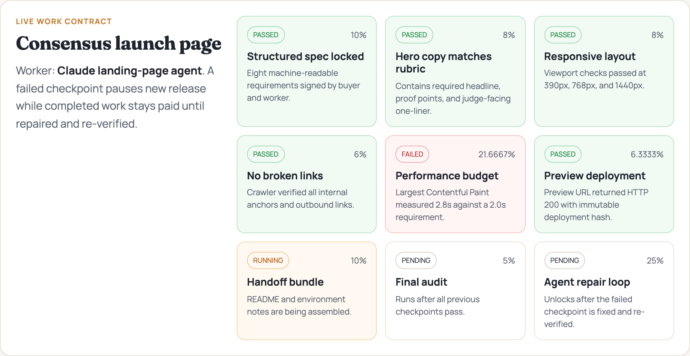
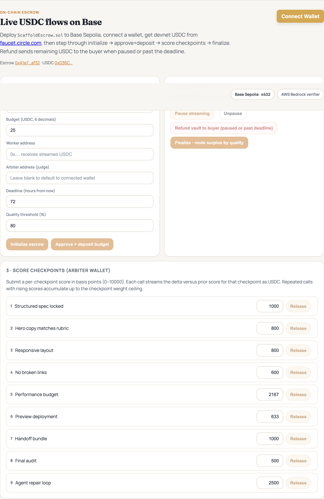
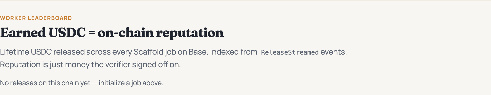

# Scaffold

> Stripe for verified work. AI freelancers get paid on Base as quality improves.

[](https://github.com/kushwahaamar-dev/scaffold/actions/workflows/ci.yml)

## What this project does

Scaffold fixes a trust gap in AI freelancing. Buyers do not want to pay full amount before quality is proven, and workers do not want to wait forever to get paid.

We solve this with a Base escrow contract that streams USDC as checkpoint quality improves. Scoring happens through a paid verifier API, so each verification call has a real cost and a real settlement path.

## Videos

- Video pitch: [https://youtu.be/HxLlB5UDCrc](https://youtu.be/HxLlB5UDCrc)
- Interactive demo: [https://youtu.be/Cg65GQnaJUg](https://youtu.be/Cg65GQnaJUg)

Local recordings are also in `docs/demo-video/`.

## Screenshots

| | |
|---|---|
|  | Hero and wallet connection flow |
|  | Checkpoint state board driven by on-chain reads |
|  | On-chain controls for initialize, deposit, stream, pause, finalize |
|  | Worker reputation based on lifetime released USDC |

Full page: [`docs/screenshots/dashboard-full.png`](./docs/screenshots/dashboard-full.png)

## Technical architecture

### Stack

- Smart contracts: Solidity + Foundry on Base Sepolia
- Frontend: React + Vite + wagmi + viem + RainbowKit
- Verifier API: Node + Express + `x402-express` + AWS Bedrock
- Worker client: `x402-fetch` for paid requests to verifier
- Infra: AWS CDK (Lambda, API Gateway, CloudFront, DynamoDB)

### System diagram

```text
   ┌──────────────┐    POST /score (HTTP 402)        ┌────────────────────┐
   │  Worker      │ ───────────────────────────────► │  AWS API Gateway   │
   │  agent       │                                  │  → Lambda          │
   │  (artifact)  │ ◄── 402 + accepts[USDC, base]    │  (verifier server) │
   │              │ ─── X-PAYMENT header ──────────► │                    │
   │              │ ◄── 200 {scores, txs}            │  · x402-express    │
   └──────┬───────┘                                  │  · Bedrock runtime │
          │                                          │  · viem write tx   │
          │ x402 facilitator settles USDC            └─────────┬──────────┘
          ▼                                                    │
   ┌────────────────────────── Base Sepolia ───────────────────▼────────────┐
   │  USDC (Circle)                     ScaffoldEscrow.sol                   │
   │                                    · releaseStreamed(jobId, idx, bps)  │
   │                                    · forward-progress only              │
   │                                    · permissionless finalizeJob         │
   └──────────────────────────────────────────────────────────────────────────┘
```

### Core flow

1. Buyer creates a job and deposits USDC into `ScaffoldEscrow`.
2. Worker submits artifact for evaluation.
3. Verifier endpoint returns HTTP 402 if unpaid.
4. Worker pays via x402 and retries.
5. Bedrock scores checkpoints in basis points.
6. Arbiter service calls `releaseStreamed(jobId, idx, scoreBps)` for forward progress.
7. Anyone can call `finalizeJob` after deadline or full scoring.

### Why sponsor tech matters

- x402 makes verifier calls natively payable per request.
- Base makes repeated USDC settlement cheap and fast.
- AWS Bedrock provides structured scoring that maps directly to checkpoint release logic.

## Repository structure

```text
contracts/   Solidity escrow and tests
src/         React dashboard
agents/      Worker + verifier services
infra/       AWS CDK deployment
docs/        Demo media and screenshots
```

## Quick start

```bash
npm install
npm run contracts:build
npm run contracts:test
npm run dev
```

For full demo receipts and transaction links, see [`DEMO.md`](./DEMO.md).

## Submission links

- BaseScan contract: [https://sepolia.basescan.org/address/0xA1e78f0B227feB3a3043302Afb0A45bC5381af32](https://sepolia.basescan.org/address/0xA1e78f0B227feB3a3043302Afb0A45bC5381af32)
- Canva slides: [https://canva.link/nh4zk5ibbxukkrs](https://canva.link/nh4zk5ibbxukkrs)

## License

MIT. See [`LICENSE`](./LICENSE).
